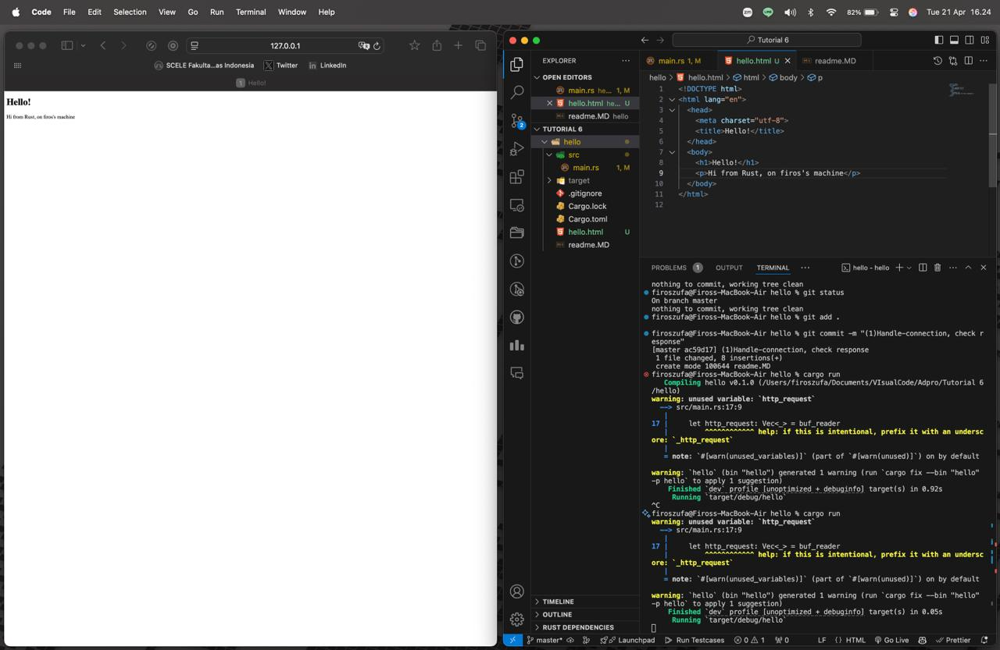
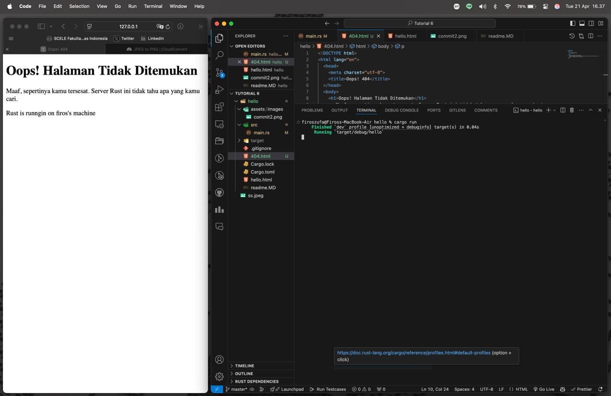

## Commit 1 Reflection notes

Di dalam fungsi `handle_connection`, kita memproses koneksi TCP yang masuk dari klien (seperti web browser). Berikut adalah pemahaman saya mengenai apa yang terjadi di dalamnya:

1. **Membaca Stream:** Fungsi ini menerima `mut stream: TcpStream`. Ini adalah aliran data (stream) antara server dan klien.
2. **Menggunakan BufReader:** Kita membungkus `stream` ke dalam `BufReader`. Ini sangat membantu karena `BufReader` mengelola *buffer* internal, sehingga kita bisa membaca data baris demi baris secara efisien (menggunakan metode `lines()`), daripada harus mengurus pembacaan *byte* per *byte* secara manual.
3. **Memparsing HTTP Request:** Kita menggunakan *iterator* dari `BufReader` untuk mengumpulkan baris-baris teks yang dikirim oleh browser sampai kita menemukan baris kosong. Baris kosong ini adalah penanda bahwa bagian *header* dari HTTP Request sudah selesai.
4. **Melihat Output:** Hasilnya, kita bisa mengumpulkan baris-baris tersebut ke dalam sebuah `Vec<_>` dan mencetaknya. Dari *output* terminal, saya bisa melihat wujud asli dari HTTP Request yang dikirimkan oleh browser saya (seperti metode `GET`, `Host`, `User-Agent`, dll).

## Commit 2 Reflection notes

Pada tahap ini, kita memodifikasi `handle_connection` agar server dapat mengembalikan respons (balasan) berupa file HTML. Berikut adalah beberapa hal baru yang saya pelajari:

1. **Membaca File HTML:** Kita menggunakan `fs::read_to_string("hello.html")` untuk membaca seluruh isi file HTML menjadi tipe data `String`.
2. **Format HTTP Response:** Agar browser mengerti balasan kita, kita tidak bisa hanya mengirim teks HTML-nya saja. Kita harus menggunakan format standar HTTP Response, yaitu:
   - **Status Line:** `HTTP/1.1 200 OK` yang menandakan *request* berhasil.
   - **Headers:** Dalam hal ini kita menambahkan `Content-Length` yang diisi dengan panjang (ukuran byte) dari konten HTML kita (`contents.len()`). Header ini penting agar browser tahu seberapa besar data yang akan ia terima sebelum koneksi ditutup.
   - **Blank Line (CRLF):** `\r\n\r\n` memisahkan antara bagian *headers* dan isi konten (*body*).
   - **Body:** Isi dari file HTML itu sendiri.
3. **Mengirim ke Stream:** Kita menggabungkan semua bagian di atas menggunakan makro `format!`, mengubahnya menjadi *byte* (`as_bytes()`), lalu mengirimkannya kembali ke *stream* menggunakan `stream.write_all()`.

Berikut adalah screenshot hasil *run* di komputer saya:

## Commit 3 Reflection notes

Pada tahap ini, saya memodifikasi server agar bisa memvalidasi *request* dan memberikan respons yang berbeda (misalnya halaman 404 jika rute tidak ditemukan). 

**Bagaimana cara memisahkan respons (splitting response)?**
Saya memisahkannya dengan memeriksa baris pertama dari HTTP Request (`request_line`). Dengan menggunakan blok `if/else` di Rust, saya mengecek apakah request tersebut persis sama dengan `"GET / HTTP/1.1"`. Jika benar, variabel penampung akan diisi dengan status `200 OK` dan file `hello.html`. Jika tidak cocok (URL selain `/`), maka statusnya menjadi `404 NOT FOUND` dan file yang dipanggil adalah `404.html`.

**Kenapa refactoring dibutuhkan?**
Sebelum di-*refactor*, blok kode `if` dan `else` sama-sama berisi perintah untuk membaca file, menghitung panjang konten, memformat HTTP *response*, dan mengirimkannya ke *stream*. Hal ini menyebabkan duplikasi kode yang melanggar prinsip *Don't Repeat Yourself* (DRY). 
Dengan refactoring, blok `if/else` hanya bertugas menentukan *nilai* dari `status_line` dan `filename`. Setelah itu, proses membaca file dan mengirim respons cukup ditulis **satu kali** saja di bawahnya. Ini membuat kode jauh lebih bersih, mudah dibaca, dan mudah dimodifikasi di kemudian hari.

Berikut adalah screenshot hasil *run* di komputer saya:

## Commit 4 Reflection notes

Pada tahap ini, penambahan rute baru `/sleep` yang akan membuat *thread* tertidur (`thread::sleep`) selama 10 detik sebelum mengembalikan respons. Rute ini digunakan untuk menyimulasikan *slow request* (proses yang memakan waktu komputasi lama).

Ketika saya menguji dengan membuka dua tab browser—satu mengakses `/sleep` dan yang lainnya mengakses `/` secara bersamaan, saya menyadari bahwa tab kedua (`/`) tidak langsung dimuat. Tab kedua harus menunggu sampai proses di tab pertama selesai dieksekusi barulah halamannya muncul.

**Mengapa hal ini terjadi?**
Ini terjadi karena server kita saat ini beroperasi menggunakan **single thread**. Artinya, program ini mengeksekusi instruksi secara sekuensial (berurutan satu per satu) di satu jalur eksekusi utama. Saat fungsi `handle_connection` memproses permintaan `/sleep`, *thread* utama tersebut tertidur dan terblokir selama 10 detik. Karena tidak ada *thread* lain yang tersedia, server tidak dapat menerima, merespons, atau memproses koneksi baru yang masuk (seperti permintaan dari tab kedua) sampai permintaan pertama benar-benar selesai. 
Di dunia nyata, arsitektur *single-threaded* seperti ini sangat berbahaya karena satu pengguna dengan koneksi lambat atau satu proses berat dapat membuat seluruh aplikasi *down* atau tidak responsif bagi seluruh pengguna lain.

## Commit 5 Reflection notes

Pada milestone ini, saya mengimplementasikan **Multithreaded Server** menggunakan konsep **ThreadPool**.

Berikut adalah pemahaman saya mengenai cara kerja ThreadPool yang baru saja dibangun:

1. **ThreadPool dan Worker:** Saat server dijalankan, `ThreadPool` membuat sejumlah `Worker` (pekerja) dengan jumlah yang sudah ditentukan (contoh: 4). Setiap `Worker` memiliki ID unik dan sebuah *thread* yang berjalan terus-menerus menunggu pekerjaan (*Job*).
2. **Komunikasi menggunakan Channel (mpsc):** Untuk mengirim pekerjaan dari *thread* utama (yang menerima koneksi TCP) ke *thread* pekerja, kita menggunakan *channel* `mpsc` (Multiple Producer, Single Consumer). `ThreadPool` bertindak sebagai *Sender* (mengirim *closure* / fungsi yang harus dieksekusi), dan para `Worker` berbagi akses ke *Receiver*.
3. **Penggunaan `Arc<Mutex<Receiver>>`:** Karena `Receiver` di Rust tidak bisa dibagi dan dimutasi oleh banyak *thread* secara bersamaan dengan aman, kita membungkusnya dengan `Arc` (Atomic Reference Counted) agar kepemilikannya bisa di-*share* ke banyak *worker*, dan `Mutex` (Mutual Exclusion) untuk memastikan hanya satu *worker* yang bisa mengambil satu *Job* dari antrean pada satu waktu.
4. **Eksekusi (`pool.execute`):** Ketika `handle_connection` selesai dipanggil, fungsi tersebut dibungkus dalam sebuah *closure* (sebagai `Job`) dan dikirimkan lewat saluran komunikasi. Salah satu `Worker` yang sedang tidak sibuk akan mengunci (`lock`) Mutex, mengambil pekerjaan tersebut, mengeksekusinya, dan kembali ke status siaga setelah selesai.

Dengan arsitektur ini, jika ada *slow request* (seperti `/sleep`), ia hanya akan memblokir satu *Worker*. Tiga *Worker* lainnya tetap bebas untuk melayani *request* lain dengan cepat.

## Commit Bonus Reflection notes

Pada bagian bonus ini, saya mengganti fungsi `ThreadPool::new` menjadi `ThreadPool::build`. 

**Perbandingan `new` vs `build`:**
* **`new` (Menggunakan assert!):** Fungsi `new` mengevaluasi argumen menggunakan `assert!(size > 0)`. Jika ukuran *pool* yang diminta adalah 0, makro `assert!` akan memicu *panic*, menyebabkan program langsung berhenti (crash) saat itu juga. Ini kurang aman karena program pemanggil tidak diberi kesempatan untuk menangani kegagalan tersebut secara elegan.
* **`build` (Mengembalikan Result):** Fungsi `build` mengembalikan tipe `Result<ThreadPool, PoolCreationError>`. Alih-alih *panic*, fungsi ini akan mengembalikan `Err` jika inputnya tidak valid. Ini adalah pendekatan idiomatik di ekosistem Rust yang mendorong *graceful error handling*. Dengan cara ini, kode pemanggil di `main.rs` dapat memutuskan sendiri tindakan pencegahannya (misalnya mencetak pesan *error* ke *stderr* dan melakukan *exit* secara terkontrol, atau mencoba menggunakan nilai *default* lain) tanpa membuat seluruh aplikasi *crash* secara tiba-tiba.